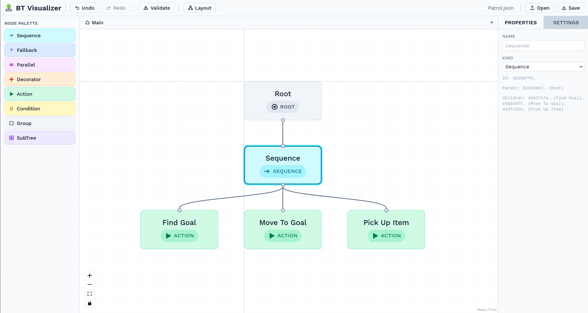
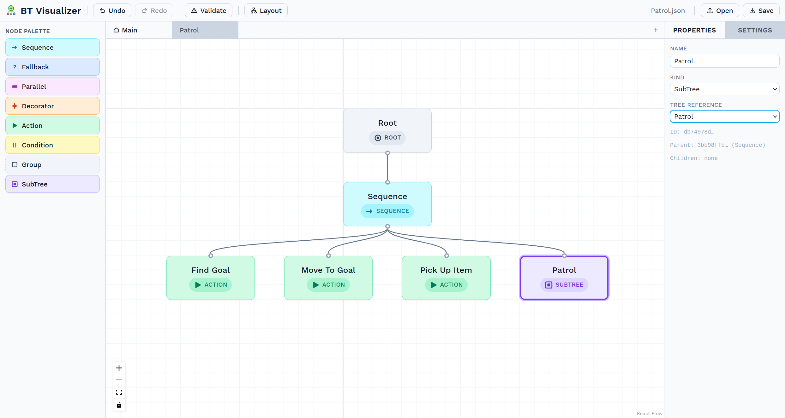
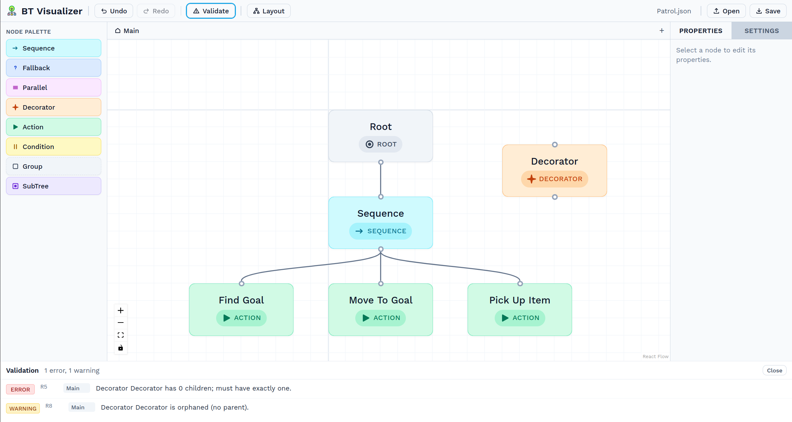
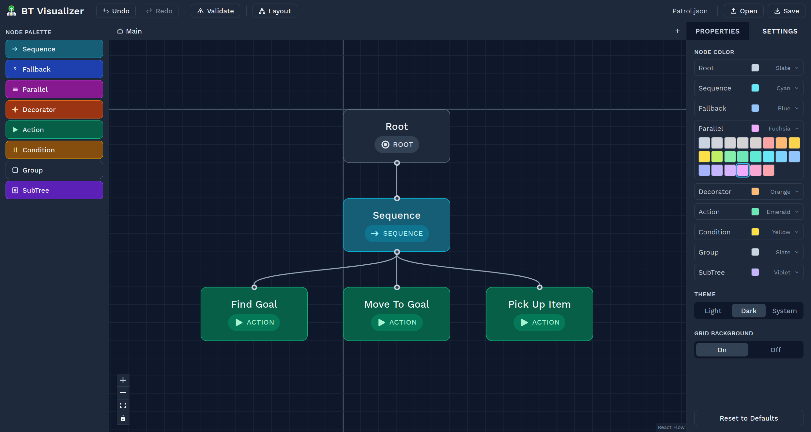

<h1 align="center">BT Visualizer</h1>

<p align="center">
  <a href="README.md">English</a> | <a href="README.zh-TW.md">中文</a>
</p>

<p align="center">
  <em>A progressive web app (PWA) for authoring, visualizing, and validating behavior-tree structures.</em>
</p>

<p align="center">
  
</p>

A browser-based editor for behavior trees. Behavior trees are a decision-making structure commonly used in robotics systems and game AI. In this editor, you can drag nodes from a palette, connect them by their handles, validate structural correctness against behavior-tree rules, and save or load standards-aligned JSON.

Everything runs in the browser; there is no server, no account, and the tool stays available offline after the first load.

Built for robotics and game-AI developers who want a focused authoring tool without spinning up a heavyweight environment, and for researchers and students who prefer to learn behavior-tree concepts by building them visually.

## Highlights

### Drag-and-drop behavior-tree node editing

Drag nodes from the palette onto the canvas, snap them to the grid, connect them by their handles, and let auto-layout tidy the result.

<!--
  Placeholder image. Replace with a screen-recorded GIF that shows:
  drag-and-drop from palette → snap-to-grid placement → connect handles →
  auto-layout. Save as docs/screenshots/authoring.gif and update the src below.
-->
<p align="center">
  
</p>

- Six behavior-tree node types: Root, Sequence, Fallback, Action, Condition, and Decorator. The editor also supports Group and SubTree pseudo nodes to help users design behavior-tree structures.
- Drag-and-drop from the palette, with automatic snap-to-grid placement.
- Multi-select via `Shift+Click`, box-select, or `Ctrl/Cmd+A`.
- Duplicate selected objects (`Ctrl/Cmd+D`), preserving connections within the duplicated subgraph.
- Child ordering is derived from horizontal canvas position, so node order does not need to be defined manually.

### Multi-subtree editing

A single file can contain multiple tree structures, accessed through in-app tabs. A SubTree node references another tree by name and displays its label.

<p align="center">
  
</p>

### Structural validation

Click **Validate** to run structural validation: child-count constraints for each node type, broken SubTree references, orphan nodes, duplicate IDs, and more. Each issue in the validation panel can be clicked to reveal the offending node, including nodes across tabs.

<p align="center">
  
</p>

### Theming

Light and dark themes, with per-node color customization via the **Settings** panel in the right sidebar. Preferences persist across reloads.

<p align="center">
  
</p>

## Installation and quickstart

Prerequisites: **Node.js 20+**.

```bash
git clone <this-repo>
cd behavior-tree-visualization-tool
npm install
npm run dev        # opens http://localhost:5173
```

To install as a PWA from a Chromium-based browser, click the install icon in the address bar (or use the browser's install menu).

## npm scripts

| Script | Purpose |
|---|---|
| `npm run dev` | Vite dev server with HMR. |
| `npm run build` | Type-check and produce a static `dist/`. |
| `npm run preview` | Preview the production build locally. |
| `npm test` | Vitest in watch mode. |
| `npm run test:ci` | Single-shot unit tests with coverage. |
| `npm run test:e2e` | Playwright e2e tests. |
| `npm run typecheck` | TypeScript only, no emit. |
| `npm run lint` | ESLint with `--fix`. |
| `npm run format` | Prettier on the whole tree. |
| `npm run icons` | Regenerate PWA icon set from sources. |

## User Guide

More detail about keyboard shortcuts, tool walkthrough, multi-tree workflow. See: [`user-guide.md`](user-guide.md).
