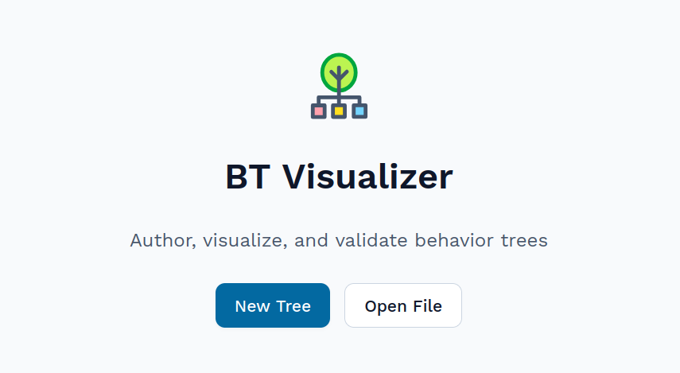
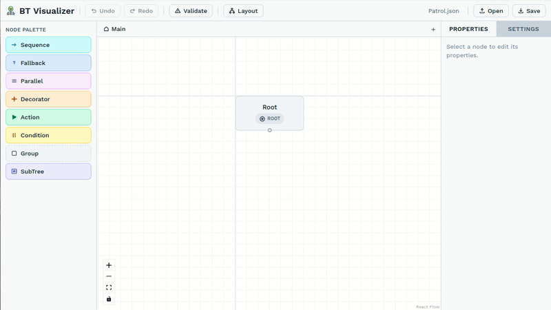
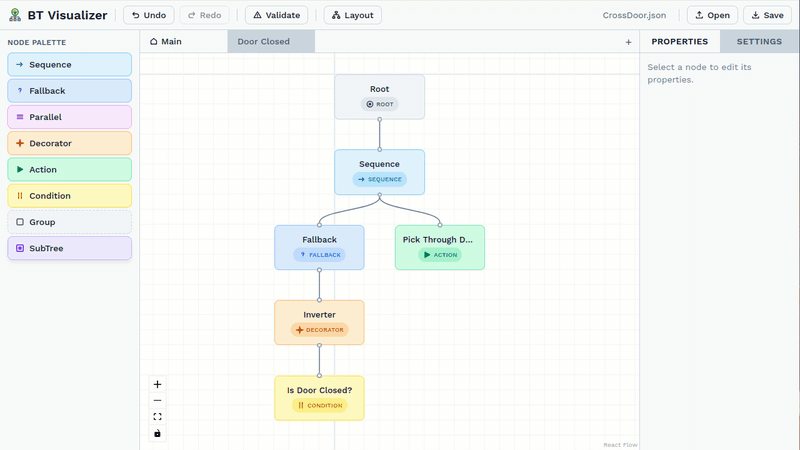
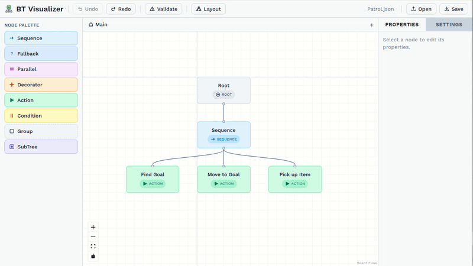
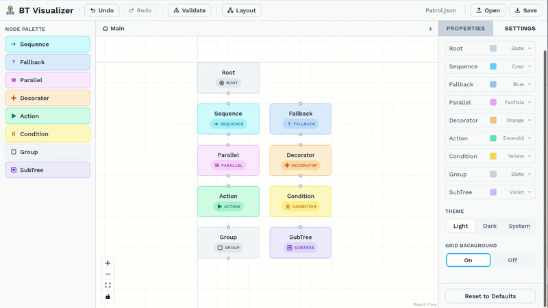

<h1 align="center">BT Visualizer</h1>

<p align="center">
  <a href="README.md">English</a> | <a href="README.zh-TW.md">中文</a>
</p>

<p align="center">
  <em>用於編輯、視覺化與驗證行為樹結構的漸進式網頁應用程式（PWA）。</em>
</p>

<p align="center">
  
</p>

這是一個運作於瀏覽器的行為樹編輯器。行為樹（Behavior Tree）是機器人系統與遊戲 AI 常用的一種決策結構。在這個編輯器裡，你可以從節點面板拖曳節點、透過節點的把手建立連線、依照行為樹規則驗證結構合法性，並儲存或載入符合標準的 JSON。

所有功能都在瀏覽器中執行；不需要伺服器、不需要帳號，而且第一次載入後仍可離線使用。

本工具適合機器人與遊戲 AI 開發者，不必啟動龐大的環境就能使用專注的編輯工具；也適合研究人員與學生，透過視覺化建構來學習行為樹概念。

## 特點

### 拖曳編輯行為樹節點

從節點面板將節點拖曳到畫布、貼齊格線、透過節點把手建立連線，並讓自動排版整理結果。

<p align="center">
  
</p>

- 支援六種節點類型： 根節點（`Root`）、序列節點（`Sequence`）、回退節點（`Fallback`）、動作節點（`Action`）、條件節點（`Condition`）、裝飾節點（`Decorator`）。並且額外支援群組（`Group`）和子樹（`SubTree`）這兩種偽節點輔助使用者設計行為樹的結構。
- 可從節點面板拖放，並自動貼齊格線。
- 可透過 `Shift+Click`、框選或 `Ctrl/Cmd+A` 進行多節點選取。
- 複製選取的物件（`Ctrl/Cmd+D`），被複製的子圖內的連線會被保留。
- 子節點次序由畫布上的水平位置決定，不需要手動定義節點次序。

### 多子樹編輯

一份檔案可以包含多個樹狀結構，並透過程式內的標籤頁存取。子樹（`SubTree`）節點會以名稱參照另一棵樹，並顯示其標籤。

<p align="center">
  
</p>

### 驗證合法性

點擊 **驗證（Validate）** 按鈕即可執行結構合法性驗證：每種節點類型的子節點數量限制、失效的子樹（`SubTree`）參照、孤立節點、重複 ID 等。驗證面板上的每個問題都可以透過點選來揭示造成問題的節點，跨分頁的節點也包含在內。

<p align="center">
  
</p>

### 主題

支援亮色與暗色主題，並可在右側邊欄的 **設定（Settings）** 面板中自訂各節點的顏色。偏好設定會在重新載入後保留。

<p align="center">
  
</p>

## 安裝與快速啟動

前置需求：**Node.js 20+**。

```bash
git clone <this-repo>
cd behavior-tree-visualization-tool
npm install
npm run dev        # opens http://localhost:5173
```

若要從 Chromium 系列瀏覽器安裝為 PWA，請點擊網址列中的安裝圖示，或使用瀏覽器的安裝選單。

## npm scripts

| 指令 | 用途 |
|---|---|
| `npm run dev` | 啟動支援 HMR 的 Vite 開發伺服器。 |
| `npm run build` | 執行型別檢查並產生靜態 `dist/`。 |
| `npm run preview` | 在本機預覽 production build。 |
| `npm test` | 以 watch mode 執行 Vitest。 |
| `npm run test:ci` | 執行單次單元測試並產生覆蓋率。 |
| `npm run test:e2e` | 執行 Playwright e2e 測試。 |
| `npm run typecheck` | 只執行 TypeScript 檢查，不輸出檔案。 |
| `npm run lint` | 執行 ESLint，並帶有 `--fix`。 |
| `npm run format` | 對整個專案執行 Prettier。 |
| `npm run icons` | 從來源重新產生 PWA 圖示集。 |

## 使用手冊

有關鍵盤快捷鍵、工具使用指南、多樹工作流程的更多詳細資訊，請參閱：[`user-guide.zh-TW.md`](user-guide.zh-TW.md)。
